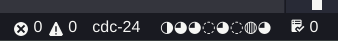

# nvidia-smi

Shows the GPU usage at status bar.

## Styles

* circle `◌◔◑◕◍`
* bar `▁▂▃▄▅▆▇█`
* recycle `♺♳♴♵♶♷♸♹`
* die `⛶⚀⚁⚂⚃⚄⚅`
* clock `🕛🕐🕑🕒🕓🕔🕕🕖🕗🕘🕙🕚`
* line `⎽⎼⎻⎺`
* pile `𝄖𝄗𝄘𝄙𝄚𝄛`
* digit `0123456789`
* circledigit `🄋➀➁➂➃➄➅➆➇➈`
* negativecircledigit `🄌➊➋➌➍➎➏➐➑➒`
* wan `🀆🀈🀉🀊🀋🀌🀍🀎🀏`
* tiao `🀆🀐🀑🀒🀓🀔🀕🀖🀗🀘`
* bing `🀆🀙🀚🀛🀜🀝🀞🀟🀠🀡`

-----------------------------------------------------------------------------------------------------------

**Enjoy!**
